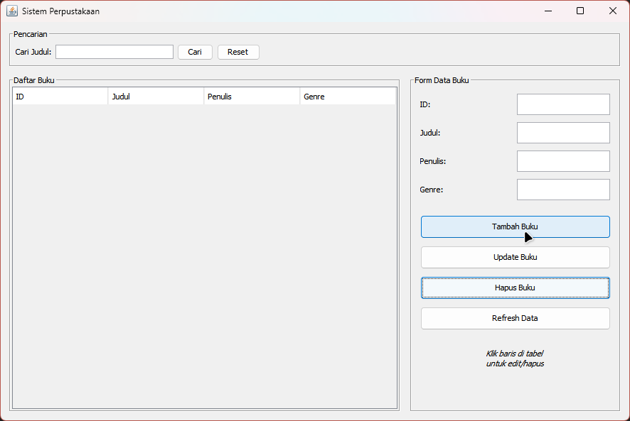

# Sistem Perpustakaan


Aplikasi sederhana untuk mengelola data buku perpustakaan menggunakan Java dan SQLite.

## Fitur

- Tambah buku
- Tampilkan semua buku
- Cari buku berdasarkan judul
- Update data buku
- Hapus buku
- Tersedia 2 mode: Console dan GUI (Java Swing)

## Kebutuhan Sistem

- JDK 8 atau lebih baru
- Folder `lib` berisi driver JDBC SQLite (`sqlite-jdbc-3.51.2.0.jar`)

## Struktur Proyek

```text
testoss/
├── lib/
│   ├── sqlite-jdbc-3.51.2.0.jar
│   └── mysql-connector-j-9.6.0.jar
├── src/
│   ├── database/
│   │   └── KoneksiDatabase.java
│   ├── main/
│   │   └── MainApp.java
│   ├── model/
│   │   ├── Buku.java
│   │   ├── BukuFiksi.java
│   │   └── BukuNonFiksi.java
│   ├── service/
│   │   ├── PerpustakaanService.java
│   │   └── PerpustakaanServiceImpl.java
│   └── ui/
│       └── MainGUI.java
├── compile.bat
├── run-console.bat
├── run-gui.bat
└── perpustakaan.db (otomatis dibuat)
```

## Cara Menjalankan

### Opsi 1 (Paling mudah di Windows)

1. Jalankan `compile.bat`
2. Jalankan salah satu:
   - `run-gui.bat` untuk mode GUI
   - `run-console.bat` untuk mode Console

### Opsi 2 (Manual via terminal)

#### Compile

Windows:

```cmd
javac -encoding UTF-8 -cp "lib/*" -d out src/database/*.java src/model/*.java src/service/*.java src/ui/*.java src/main/*.java
```

Linux/MacOS:

```bash
javac -encoding UTF-8 -cp "lib/*" -d out src/database/*.java src/model/*.java src/service/*.java src/ui/*.java src/main/*.java
```

#### Jalankan GUI

Windows:

```cmd
java -cp "out;lib/*" ui.MainGUI
```

Linux/MacOS:

```bash
java -cp "out:lib/*" ui.MainGUI
```

#### Jalankan Console

Windows:

```cmd
java -cp "out;lib/*" main.MainApp
```

Linux/MacOS:

```bash
java -cp "out:lib/*" main.MainApp
```

## Catatan

- File database `perpustakaan.db` dibuat otomatis saat aplikasi dijalankan pertama kali.
- Jika ingin reset data, hapus file `perpustakaan.db`.

## Troubleshooting

**`javac` tidak dikenali**

- Pastikan JDK sudah terpasang dan PATH sudah benar.
- Cek dengan `java -version` dan `javac -version`.

**`No suitable driver found for jdbc:sqlite`**

- Pastikan file `sqlite-jdbc-3.51.2.0.jar` ada di folder `lib`.
- Pastikan classpath saat compile/run menyertakan `lib/*`.

**`Could not find or load main class`**

- Pastikan proses compile berhasil.
- Pastikan folder `out` berisi file `.class`.
